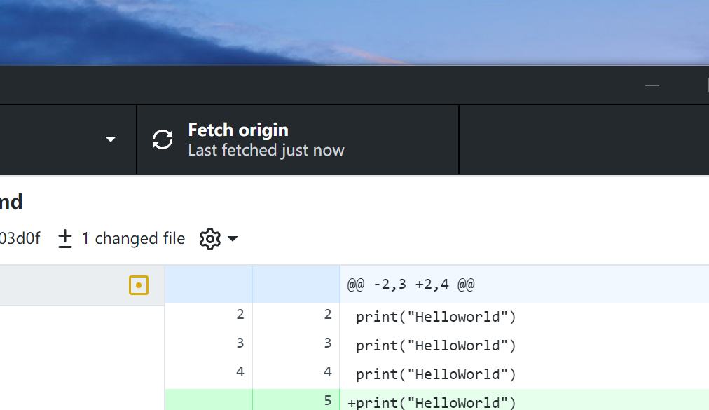

# EL.0
！！！！！！
Please read me！！！！！！
这是一个实验项目
大家记得在这上面试手
最后是用cocos的JS写
加油冲冲冲！！！！！！
print("Helloworld")
print("HelloWorld")
print("HelloWorld")!
print("HelloWorld")
print("Please read me")

print("Let's start!")
print("......")

desktop

print("Desk Top")
